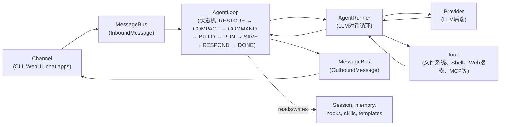
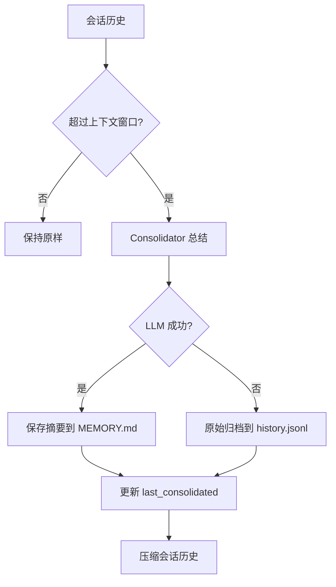
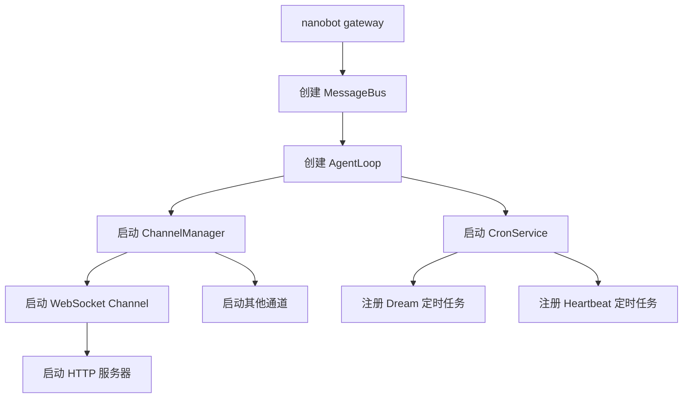

# nanobot 技术原理分析报告

---

## 一、项目概述

### 1.1 项目定位与核心价值

nanobot 是一款轻量级、开源的个人 AI Agent 框架，其核心设计理念是**保持核心循环小巧可读，同时提供完整的实用功能**。

**核心特性：**

| 特性 | 说明 |
|------|------|
| **持久化工作流** | 目标、记忆、工具和聊天上下文支持长期运行 |
| **多渠道支持** | WebUI、API、Telegram、Feishu、Slack、Discord、Teams、Email 等 |
| **模型自由切换** | 支持 OpenAI 兼容 API、本地 LLM、图像生成、搜索和故障转移 |
| **可扩展性** | 插件化设计，易于添加新的 Provider、Channel 和 Tool |

### 1.2 技术栈概览

| 层次 | 技术 |
|------|------|
| 后端语言 | Python 3.11+ |
| 并发模型 | asyncio |
| 数据验证 | Pydantic |
| 前端 | React/TypeScript、Vite |
| 通信协议 | WebSocket、HTTP API |
| 存储 | JSONL 文件存储 |

### 1.3 架构设计原则

nanobot 遵循以下核心设计原则：

1. **模块化设计**：各组件职责清晰，解耦性强
2. **事件驱动**：通过消息总线实现组件间通信
3. **可插拔扩展**：Provider、Channel、Tool 均支持插件化扩展
4. **优雅降级**：支持故障转移和自动恢复

---

## 二、核心架构设计

### 2.1 整体架构图



### 2.2 核心组件职责划分

**AgentLoop vs AgentRunner 的职责分离：**

| AgentLoop（通道侧） | AgentRunner（模型侧） |
|---------------------|----------------------|
| 接收入站消息 | 发送消息到 Provider |
| 确定会话和工作空间范围 | 处理流式增量和推理块 |
| 构建上下文 | 执行工具调用 |
| 连接钩子、进度和通道元数据 | 将工具结果反馈给模型 |
| 发布出站消息 | 在生成最终答案或达到运行时限制时停止 |

### 2.3 关键设计模式

nanobot 运用了多种设计模式来实现其架构目标：

**1. 事件总线模式**
- `MessageBus` 实现发布-订阅模式，解耦通道与代理核心
- 入站和出站队列分离，避免消息混淆

**2. 策略模式**
- 不同 Provider 实现相同接口，可动态切换
- 通过 `ProviderFactory` 根据配置创建对应的 Provider 实例

**3. 状态机模式**
- AgentLoop 使用状态机管理消息处理流程
- 明确的状态转换规则确保处理流程的可靠性

**4. 工厂模式**
- `ProviderFactory` 根据配置动态创建 Provider
- 支持多种 Provider 类型的统一创建入口

---

## 三、消息总线与事件系统

### 3.1 MessageBus 核心机制

`MessageBus` 是 nanobot 的消息路由中枢，通过两个异步队列实现解耦：

```python
# nanobot/bus/queue.py
class MessageBus:
    def __init__(self):
        self.inbound: asyncio.Queue[InboundMessage] = asyncio.Queue()
        self.outbound: asyncio.Queue[OutboundMessage] = asyncio.Queue()

    async def publish_inbound(self, msg: InboundMessage) -> None:
        await self.inbound.put(msg)

    async def consume_inbound(self) -> InboundMessage:
        return await self.inbound.get()

    async def publish_outbound(self, msg: OutboundMessage) -> None:
        await self.outbound.put(msg)

    async def consume_outbound(self) -> OutboundMessage:
        return await self.outbound.get()
```

**设计要点：**

1. **异步队列**：使用 `asyncio.Queue` 实现异步消息传递，支持高并发场景
2. **队列分离**：入站和出站队列分离，避免消息混淆
3. **接口简洁**：提供 `publish` 和 `consume` 方法，便于使用

### 3.2 事件类型体系

**InboundMessage（入站消息）：**

```python
# nanobot/bus/events.py
@dataclass
class InboundMessage:
    channel: str          # telegram, discord, slack, whatsapp
    sender_id: str        # 用户标识符
    chat_id: str          # 聊天/频道标识符
    content: str          # 消息文本
    timestamp: datetime = field(default_factory=datetime.now)
    media: list[str] = field(default_factory=list)
    metadata: dict[str, Any] = field(default_factory=dict)
    session_key_override: str | None = None

    @property
    def session_key(self) -> str:
        return self.session_key_override or f"{self.channel}:{self.chat_id}"
```

**设计要点：**
- `session_key` 属性根据 `session_key_override` 或组合 `channel:chat_id` 生成
- 支持媒体附件和元数据
- 时间戳自动生成

**OutboundMessage（出站消息）：**

```python
@dataclass
class OutboundMessage:
    channel: str
    chat_id: str
    content: str
    reply_to: str | None = None
    media: list[str] = field(default_factory=list)
    metadata: dict[str, Any] = field(default_factory=dict)
    buttons: list[list[str]] = field(default_factory=list)
```

**元数据关键字：**
- `OUTBOUND_META_AGENT_UI`: 结构化的、与通道无关的 UI payload
- `INBOUND_META_RUNTIME_CONTROL`: 内部运行时控制信号

### 3.3 异步消息处理机制

在 `AgentLoop.run()` 中实现了消息消费循环：

```python
# nanobot/agent/loop.py - run() 方法
while self._running:
    try:
        msg = await asyncio.wait_for(self.bus.consume_inbound(), timeout=1.0)
    except asyncio.TimeoutError:
        self.auto_compact.check_expired(...)
        continue
    # 处理消息...
```

**关键机制：**

1. **超时机制**：使用 `asyncio.wait_for` 设置 1 秒超时，避免无限阻塞
2. **定期检查**：超时期间执行自动压缩检查（`auto_compact.check_expired`）
3. **异常处理**：捕获 `asyncio.CancelledError` 和其他异常，确保消息总线稳定运行

---

## 四、Agent Loop 核心机制

### 4.1 AgentLoop 状态机设计

`AgentLoop` 使用状态机模式管理消息处理流程：

```python
# nanobot/agent/loop.py
class TurnState(Enum):
    RESTORE = auto()      # 恢复会话状态
    COMPACT = auto()      # 压缩上下文
    COMMAND = auto()      # 命令路由
    BUILD = auto()        # 构建消息上下文
    RUN = auto()          # 执行 AgentRunner 循环
    SAVE = auto()         # 保存会话历史
    RESPOND = auto()      # 发布响应消息
    DONE = auto()         # 完成

# 状态转换表
_TRANSITIONS: dict[tuple[TurnState, str], TurnState] = {
    (TurnState.RESTORE, "ok"): TurnState.COMPACT,
    (TurnState.COMPACT, "ok"): TurnState.COMMAND,
    (TurnState.COMMAND, "dispatch"): TurnState.BUILD,
    (TurnState.COMMAND, "shortcut"): TurnState.DONE,
    (TurnState.BUILD, "ok"): TurnState.RUN,
    (TurnState.RUN, "ok"): TurnState.SAVE,
    (TurnState.SAVE, "ok"): TurnState.RESPOND,
    (TurnState.RESPOND, "ok"): TurnState.DONE,
}
```

**状态机流程详解：**

| 状态 | 职责 | 说明 |
|------|------|------|
| **RESTORE** | 恢复会话状态 | 从磁盘加载会话历史 |
| **COMPACT** | 压缩上下文 | 自动压缩过期会话，控制内存占用 |
| **COMMAND** | 命令路由 | 处理 `/stop`、`/model` 等命令 |
| **BUILD** | 构建上下文 | 组装系统提示、历史消息、工具定义 |
| **RUN** | 执行循环 | 调用 AgentRunner 执行 LLM 对话 |
| **SAVE** | 保存会话 | 将新消息持久化到磁盘 |
| **RESPOND** | 发布响应 | 通过消息总线发送响应 |
| **DONE** | 完成 | 结束当前消息处理 |

### 4.2 消息分发机制

`AgentLoop._dispatch()` 方法实现了消息分发的核心逻辑：

```python
async def _dispatch(self, msg: InboundMessage) -> None:
    session_key = self._effective_session_key(msg)
    lock = self._session_locks.setdefault(session_key, asyncio.Lock())
    gate = self._concurrency_gate or nullcontext()

    async with lock, gate:
        pending = asyncio.Queue(maxsize=20)
        self._pending_queues[session_key] = pending
        
        # 处理流式响应
        if msg.metadata.get("_wants_stream"):
            async def on_stream(delta: str) -> None:
                meta = dict(msg.metadata or {})
                meta["_stream_delta"] = True
                await self.bus.publish_outbound(OutboundMessage(...))

            async def on_stream_end(*, resuming: bool = False) -> None:
                meta = dict(msg.metadata or {})
                meta["_stream_end"] = True
                meta["_resuming"] = resuming
                await self.bus.publish_outbound(OutboundMessage(...))

        response = await self._process_message(
            msg, on_stream=on_stream, on_stream_end=on_stream_end,
            pending_queue=pending,
        )
        
        if response is not None:
            await self.bus.publish_outbound(response)
```

**关键设计：**

1. **会话锁**：使用 `asyncio.Lock` 保证同一会话的消息串行处理
2. **并发限制**：通过 `_concurrency_gate` 限制并发请求数量（默认 3）
3. **待处理队列**：支持中途消息注入，实现对话的连续性
4. **流式响应**：支持实时流式输出，提升用户体验

### 4.3 上下文构建策略

`_build_initial_messages()` 方法负责构建 LLM 输入的上下文：

```python
def _build_initial_messages(
    self,
    msg: InboundMessage,
    session: Session,
    history: list[dict[str, Any]],
    pending_summary: str | None,
    include_memory_recent_history: bool = True,
) -> list[dict[str, Any]]:
    scope = self.workspace_scopes.for_message(msg, session.metadata)
    return self.context.build_messages(
        history=history,
        current_message=image_generation_prompt(msg.content, msg.metadata),
        media=msg.media if msg.media else None,
        channel=msg.channel,
        chat_id=self._runtime_chat_id(msg),
        sender_id=msg.sender_id,
        session_summary=pending_summary,
        session_metadata=session.metadata,
        workspace=scope.project_path,
        runtime_state=self,
        inbound_message=msg,
        include_memory_recent_history=include_memory_recent_history,
        session_key=session.key,
        unified_session=self._unified_session,
    )
```

**上下文组成：**

| 组成部分 | 说明 |
|----------|------|
| **历史消息** | 会话历史，用于上下文理解 |
| **当前消息** | 用户当前输入 |
| **媒体附件** | 图片等附加内容 |
| **会话摘要** | 之前压缩的会话摘要 |
| **运行时状态** | 当前运行时上下文（时间、通道等） |
| **工作空间** | 当前工作空间路径 |

---

## 五、Agent Runner 执行机制

### 5.1 核心执行循环

`AgentRunner.run()` 方法实现了 LLM 对话循环的核心逻辑：

```python
async def _run_core(
    self,
    spec: AgentRunSpec,
    hook: AgentHook,
    messages: list[dict[str, Any]],
) -> AgentRunResult:
    for iteration in range(spec.max_iterations):
        # 1. 上下文治理
        messages_for_model = self._drop_orphan_tool_results(messages)
        messages_for_model = self._backfill_missing_tool_results(messages_for_model)
        messages_for_model = self._microcompact(messages_for_model)
        messages_for_model = self._apply_tool_result_budget(spec, messages_for_model)
        messages_for_model = self._snip_history(spec, messages_for_model)
        
        # 2. 请求模型
        response = await self._request_model(spec, messages_for_model, hook, context)
        
        # 3. 处理工具调用
        if response.should_execute_tools:
            results, new_events, fatal_error = await self._execute_tools(...)
            # 添加工具结果到消息历史
            messages.append(tool_message)
            continue
        
        # 4. 处理最终响应
        if response.finish_reason != "error":
            messages.append(assistant_message)
            break
```

**关键设计：**

1. **上下文治理**：自动清理孤立工具结果、填充缺失结果、压缩历史
2. **工具执行**：支持并发工具执行（`concurrent_tools=True`）
3. **迭代控制**：通过 `max_iterations` 限制工具调用次数

### 5.2 上下文治理机制

**1. 清理孤立工具结果**：

```python
def _drop_orphan_tool_results(self, messages: list[dict]) -> list[dict]:
    """移除没有对应工具调用的工具结果"""
    tool_call_ids = set()
    for msg in messages:
        if msg.get("tool_calls"):
            for call in msg["tool_calls"]:
                tool_call_ids.add(call["id"])
    
    return [
        msg for msg in messages
        if msg.get("role") != "tool" or msg.get("tool_call_id") in tool_call_ids
    ]
```

**2. 填充缺失的工具结果**：

```python
def _backfill_missing_tool_results(self, messages: list[dict]) -> list[dict]:
    """为未完成的工具调用填充占位符"""
    result = []
    for msg in messages:
        result.append(msg)
        if msg.get("tool_calls"):
            for call in msg["tool_calls"]:
                call_id = call["id"]
                has_result = any(
                    m.get("tool_call_id") == call_id
                    for m in messages
                    if m.get("role") == "tool"
                )
                if not has_result:
                    result.append({
                        "role": "tool",
                        "tool_call_id": call_id,
                        "name": call["name"],
                        "content": _BACKFILL_CONTENT,
                    })
    return result
```

**3. 微压缩**：

```python
def _microcompact(self, messages: list[dict]) -> list[dict]:
    """压缩可压缩的工具结果（如 read_file、exec 等）"""
    compactable = _COMPACTABLE_TOOLS
    result = []
    for msg in messages:
        if (msg.get("role") == "tool" 
            and msg.get("name") in compactable
            and len(msg.get("content", "")) > _MICROCOMPACT_MIN_CHARS
        ):
            # 压缩长工具结果
            content = msg["content"]
            if len(content) > _MICROCOMPACT_MIN_CHARS:
                msg = dict(msg)
                msg["content"] = truncate_text(content, _MICROCOMPACT_MIN_CHARS)
        result.append(msg)
    return result
```

### 5.3 工具执行机制

**工具批处理和并发执行：**

```python
async def _execute_tools(
    self,
    spec: AgentRunSpec,
    tool_calls: list[ToolCallRequest],
    external_lookup_counts: dict[str, int],
    workspace_violation_counts: dict[str, int],
) -> tuple[list[Any], list[dict[str, str]], BaseException | None]:
    batches = self._partition_tool_batches(spec, tool_calls)
    tool_results: list[tuple[Any, dict[str, str], BaseException | None]] = []
    
    for batch in batches:
        if spec.concurrent_tools and len(batch) > 1:
            # 并发执行
            batch_results = await asyncio.gather(*(
                self._run_tool(spec, tool_call, ...)
                for tool_call in batch
            ))
            tool_results.extend(batch_results)
        else:
            # 串行执行
            for tool_call in batch:
                result = await self._run_tool(spec, tool_call, ...)
                tool_results.append(result)
    
    # 汇总结果
    results: list[Any] = []
    events: list[dict[str, str]] = []
    fatal_error: BaseException | None = None
    for result, event, error in tool_results:
        results.append(result)
        events.append(event)
        if error is not None and fatal_error is None:
            fatal_error = error
    
    return results, events, fatal_error
```

**工具批处理策略：**

1. **并发工具**：标记为 `concurrency_safe` 的工具可以并发执行
2. **互斥工具**：标记为 `exclusive` 的工具必须单独执行
3. **安全检查**：执行前检查外部查找次数和工作空间违规次数

---

## 六、Provider 系统

### 6.1 Provider 抽象层

`LLMProvider` 是所有 Provider 的基类，定义了统一接口：

```python
# nanobot/providers/base.py
class LLMProvider(ABC):
    supports_progress_deltas = False
    
    @abstractmethod
    async def chat(
        self,
        messages: list[dict[str, Any]],
        tools: list[dict[str, Any]] | None = None,
        model: str | None = None,
        max_tokens: int = 4096,
        temperature: float = 0.7,
        reasoning_effort: str | None = None,
        tool_choice: str | dict[str, Any] | None = None,
    ) -> LLMResponse:
        pass

    @abstractmethod
    def get_default_model(self) -> str:
        pass
```

**LLMResponse 结构：**

```python
@dataclass
class LLMResponse:
    content: str | None
    tool_calls: list[ToolCallRequest] = field(default_factory=list)
    finish_reason: str = "stop"
    usage: dict[str, int] = field(default_factory=dict)
    retry_after: float | None = None
    reasoning_content: str | None = None      # Kimi, DeepSeek-R1, MiMo 等
    thinking_blocks: list[dict] | None = None # Anthropic extended thinking
```

### 6.2 多 Provider 实现

nanobot 支持多种 Provider：

| Provider | 文件 | 特点 |
|----------|------|------|
| OpenAI 兼容 | `openai_compat_provider.py` | 通用 HTTP API 支持 |
| Anthropic | `anthropic_provider.py` | 原生 Claude 支持，思考块 |
| Azure OpenAI | `azure_openai_provider.py` | Azure 托管服务 |
| AWS Bedrock | `bedrock_provider.py` | AWS 托管的多种模型 |
| GitHub Copilot | `github_copilot_provider.py` | OAuth 认证 |
| OpenAI Codex | `openai_codex_provider.py` | 代码专用模型 |
| Fallback | `fallback_provider.py` | 故障转移机制 |

### 6.3 Provider 选择与路由

```python
# nanobot/providers/factory.py
def make_provider(config: Config) -> LLMProvider:
    """Create a provider from config."""
    defaults = config.agents.defaults
    
    # 1. 检查预设选择
    if defaults.model_preset:
        preset = config.model_presets.get(defaults.model_preset)
        if preset:
            return _make_provider_from_preset(config, preset)
    
    # 2. 直接配置
    if defaults.provider:
        return _make_provider(config, defaults.provider)
    
    # 3. 自动检测
    return _detect_provider(config)
```

**Provider 选择优先级：**

1. 显式的 `modelPreset` 配置
2. 直接的 `agents.defaults.provider` 配置
3. 根据 API 密钥前缀、API base URL 自动推断

**故障转移机制：**

```python
# FallbackProvider 实现
class FallbackProvider(LLMProvider):
    def __init__(
        self,
        primary: LLMProvider,
        fallback_presets: list[ModelPresetConfig],
        provider_factory: Callable[[ModelPresetConfig], LLMProvider],
    ):
        self.primary = primary
        self.fallback_presets = fallback_presets
        self.provider_factory = provider_factory
    
    async def chat(self, **kwargs) -> LLMResponse:
        try:
            return await self.primary.chat(**kwargs)
        except Exception as e:
            # 尝试故障转移
            for preset in self.fallback_presets:
                try:
                    provider = self.provider_factory(preset)
                    return await provider.chat(**kwargs)
                except Exception:
                    continue
            raise e
```

---

## 七、Channel 系统

### 7.1 Channel 抽象与实现

`BaseChannel` 定义了通道的基本契约：

```python
# nanobot/channels/base.py
class BaseChannel(ABC):
    name: str = "base"
    display_name: str = "Base"
    send_progress: bool = True
    send_tool_hints: bool = False
    show_reasoning: bool = True

    @abstractmethod
    async def start(self) -> None:
        pass

    @abstractmethod
    async def stop(self) -> None:
        pass

    @abstractmethod
    async def send(self, msg: OutboundMessage) -> None:
        pass
```

**内置通道：**

| 通道 | 文件 | 特性 |
|------|------|------|
| WebSocket | `websocket.py` | WebUI 通信，流式响应 |
| Telegram | `telegram.py` | 消息分割、媒体支持 |
| Discord | `discord.py` | 线程支持 |
| Slack | `slack.py` | 消息格式、提及控制 |
| Feishu | `feishu.py` | 流式响应、卡片消息 |
| WeChat | `weixin.py` | 语音转文字 |
| Email | `email.py` | 附件支持 |
| QQ | `qq.py` | 群聊支持 |

### 7.2 WebSocket Channel 深度解析

WebSocket 通道是 WebUI 的核心通信层：

```python
# nanobot/channels/websocket.py
class WebSocketChannel(BaseChannel):
    name = "websocket"
    display_name = "WebSocket"
    
    def __init__(self, config, bus, *, gateway):
        super().__init__(config, bus)
        self.config = WebSocketConfig(**config)
        # 订阅管理
        self._subs: dict[str, set[Any]] = {}  # chat_id -> connections
        self._conn_chats: dict[Any, set[str]] = {}  # connection -> chat_ids
        self._conn_default: dict[Any, str] = {}  # connection -> default_chat_id
    
    async def start(self) -> None:
        """启动 WebSocket 服务器"""
        ssl_context = self._build_ssl_context()
        async def handler(connection: ServerConnection) -> None:
            await self._connection_loop(connection)
        
        if self.config.unix_socket_path:
            server = await unix_serve(handler, self.config.unix_socket_path, ...)
        else:
            server = await serve(handler, self.config.host, self.config.port, ...)
        
        await self._stop_event.wait()
        await server.close()
```

**协议设计：**

1. **多路复用**：多个聊天会话共享一个连接
2. **订阅机制**：通过 `_attach()` 和 `_cleanup_connection()` 管理订阅
3. **流式响应**：支持实时显示

**消息分发：**

```python
async def _dispatch_envelope(self, connection, client_id, envelope):
    t = envelope.get("type")
    
    if t == "new_chat":
        new_id = str(uuid.uuid4())
        # 创建新会话
        self._attach(connection, new_id)
        await self._send_event(connection, "attached", chat_id=new_id)
    
    elif t == "attach":
        cid = envelope.get("chat_id")
        self._attach(connection, cid)
        await self._send_event(connection, "attached", chat_id=cid)
    
    elif t == "message":
        cid = envelope.get("chat_id")
        content = envelope.get("content")
        media_paths = self._save_envelope_media(envelope.get("media"))
        
        # 自动订阅
        self._attach(connection, cid)
        await self._handle_message(
            sender_id=client_id,
            chat_id=cid,
            content=content,
            media=media_paths,
            metadata=metadata,
        )
```

---

## 八、Tool 系统

### 8.1 Tool 定义与注册

```python
# nanobot/agent/tools/base.py
class Tool(ABC):
    """Agent capability: read files, run commands, etc."""
    
    @property
    @abstractmethod
    def name(self) -> str:
        """Tool name used in function calls."""
        ...

    @property
    @abstractmethod
    def description(self) -> str:
        """Description of what the tool does."""
        ...

    @property
    @abstractmethod
    def parameters(self) -> dict[str, Any]:
        """JSON Schema for tool parameters."""
        ...

    @property
    def read_only(self) -> bool:
        """Whether this tool is side-effect free and safe to parallelize."""
        return False

    @property
    def concurrency_safe(self) -> bool:
        """Whether this tool can run alongside other concurrency-safe tools."""
        return self.read_only and not self.exclusive

    @abstractmethod
    async def execute(self, **kwargs: Any) -> Any:
        """Run the tool; returns a string or list of content blocks."""
        ...
```

**工具注册机制：**

```python
# nanobot/agent/tools/registry.py
class ToolRegistry:
    def __init__(self):
        self._tools: dict[str, Tool] = {}
        self._cached_definitions: list[dict[str, Any]] | None = None
    
    def register(self, tool: Tool) -> None:
        self._tools[tool.name] = tool
        self._cached_definitions = None
    
    def get_definitions(self) -> list[dict[str, Any]]:
        """Get tool definitions with stable ordering for cache-friendly prompts."""
        if self._cached_definitions is not None:
            return self._cached_definitions
        
        definitions = [tool.to_schema() for tool in self._tools.values()]
        builtins = [d for d in definitions if not d["function"]["name"].startswith("mcp_")]
        mcp_tools = [d for d in definitions if d["function"]["name"].startswith("mcp_")]
        
        builtins.sort(key=self._schema_name)
        mcp_tools.sort(key=self._schema_name)
        self._cached_definitions = builtins + mcp_tools
        return self._cached_definitions
```

### 8.2 核心工具实现

**文件系统工具：**

```python
# nanobot/agent/tools/filesystem.py
class ReadFileTool(Tool):
    name = "read_file"
    description = "Read a file from the filesystem"
    parameters = {
        "type": "object",
        "properties": {
            "path": {"type": "string", "description": "Path to the file"},
        },
        "required": ["path"],
    }
    
    def __init__(self, workspace: Path, allowed_dir: Path, ...):
        self.workspace = workspace
        self.allowed_dir = allowed_dir
    
    async def execute(self, path: str) -> str:
        # 路径安全检查
        resolved = Path(path).resolve()
        if not str(resolved).startswith(str(self.allowed_dir.resolve())):
            raise PermissionError("Path outside allowed directory")
        
        return resolved.read_text(encoding="utf-8")
```

**Shell 工具（带沙箱）：**

```python
class ExecTool(Tool):
    name = "exec"
    description = "Execute a shell command"
    parameters = {
        "type": "object",
        "properties": {
            "command": {"type": "string", "description": "Command to execute"},
            "cwd": {"type": "string", "description": "Working directory"},
        },
        "required": ["command"],
    }
    
    def __init__(self, sandbox: SandboxPolicy):
        self.sandbox = sandbox
    
    async def execute(self, command: str, cwd: str = None) -> str:
        # 沙箱检查
        if not self.sandbox.is_allowed(command):
            raise PermissionError("Command not allowed")
        
        # 路径检查
        if cwd:
            resolved = Path(cwd).resolve()
            if not self.sandbox.is_path_allowed(resolved):
                raise PermissionError("Working directory not allowed")
        
        # 执行命令
        process = await asyncio.create_subprocess_shell(
            command,
            cwd=cwd,
            stdout=asyncio.subprocess.PIPE,
            stderr=asyncio.subprocess.PIPE,
        )
        stdout, stderr = await process.communicate()
        
        return stdout.decode("utf-8") + stderr.decode("utf-8")
```

**核心工具列表：**

| 工具名称 | 功能 | 文件 |
|----------|------|------|
| `read_file` | 读取文件 | `filesystem.py` |
| `write_file` | 写入文件 | `filesystem.py` |
| `edit_file` | 编辑文件 | `filesystem.py` |
| `exec` | 执行命令 | `shell.py` |
| `web_search` | 网页搜索 | `web.py` |
| `web_fetch` | 获取网页内容 | `web.py` |
| `cron` | 定时任务 | `cron.py` |
| `image_generation` | 图像生成 | `image_generation.py` |
| `mcp_*` | MCP 工具 | `mcp.py` |

### 8.3 工具执行安全机制

**沙箱策略：**

```python
# nanobot/agent/tools/sandbox.py
class SandboxPolicy:
    _DANGEROUS_COMMANDS = {
        "rm", "rmdir", "shutdown", "reboot", "poweroff",
        "curl", "wget", "nc", "netcat", "ssh", "scp"
    }
    
    def __init__(self, allowed_commands: list[str], workspace: Path):
        self.allowed_commands = allowed_commands
        self.workspace = workspace
    
    def is_allowed(self, command: str) -> bool:
        """检查命令是否安全"""
        cmd = command.split()[0]
        
        # 黑名单检查
        if cmd in self._DANGEROUS_COMMANDS:
            return False
        
        # 路径遍历检查
        if ".." in command or "/../" in command:
            return False
        
        # 管道和重定向限制
        if "|" in command or ">" in command or "<" in command:
            return False
        
        return True
    
    def is_path_allowed(self, path: Path) -> bool:
        """检查路径是否在工作空间内"""
        return str(path).startswith(str(self.workspace.resolve()))
```

**安全防护层次：**

| 层级 | 防护内容 |
|------|----------|
| 命令白名单 | 限制可执行的命令 |
| 路径遍历防护 | 防止访问工作空间外的文件 |
| SSRF检测 | 防止访问私有网络 |
| 工作空间隔离 | 限制文件操作范围 |

---

## 九、Memory 与 Session 管理

### 9.1 会话存储机制

```python
# nanobot/session/manager.py
class SessionManager:
    def __init__(self, workspace: Path):
        self.workspace = workspace
        self.sessions_dir = ensure_dir(self.workspace / "sessions")
        self._cache: dict[str, Session] = {}
    
    def get_or_create(self, key: str) -> Session:
        """获取或创建会话"""
        if key in self._cache:
            return self._cache[key]
        
        session = self._load(key)
        if session is None:
            session = Session(key=key)
        
        self._cache[key] = session
        return session
    
    def save(self, session: Session, *, fsync: bool = False) -> None:
        """保存会话到磁盘（原子写入）"""
        path = self._get_session_path(session.key)
        tmp_path = path.with_suffix(".jsonl.tmp")
        
        with open(tmp_path, "w", encoding="utf-8") as f:
            metadata_line = {
                "_type": "metadata",
                "key": session.key,
                "created_at": session.created_at.isoformat(),
                "updated_at": session.updated_at.isoformat(),
                "metadata": session.metadata,
                "last_consolidated": session.last_consolidated
            }
            f.write(json.dumps(metadata_line, ensure_ascii=False) + "\n")
            for msg in session.messages:
                f.write(json.dumps(msg, ensure_ascii=False) + "\n")
            if fsync:
                f.flush()
                os.fsync(f.fileno())
        
        os.replace(tmp_path, path)  # 原子替换
        
        if fsync:
            # fsync 目录确保重命名持久化
            with suppress(PermissionError):
                fd = os.open(str(path.parent), os.O_RDONLY)
                os.fsync(fd)
                os.close(fd)
```

**会话文件格式（JSONL）：**

```json
{"_type": "metadata", "key": "websocket:abc123", "created_at": "2024-01-01T00:00:00", "updated_at": "2024-01-01T00:00:00", "metadata": {}, "last_consolidated": 0}
{"role": "user", "content": "Hello", "timestamp": "2024-01-01T00:00:00"}
{"role": "assistant", "content": "Hi!", "timestamp": "2024-01-01T00:00:01"}
```

**设计要点：**

1. **原子写入**：先写入临时文件，再原子替换，确保数据完整性
2. **缓存机制**：会话缓存在内存中，减少磁盘 IO
3. **fsync 支持**：可选的持久化保证

### 9.2 长期记忆系统（Dream）

```python
# nanobot/agent/memory.py
class Consolidator:
    """Lightweight consolidation: summarizes evicted messages into history.jsonl."""
    
    def __init__(
        self,
        store: MemoryStore,
        provider: LLMProvider,
        model: str,
        sessions: SessionManager,
        context_window_tokens: int,
        build_messages: Callable[..., list[dict[str, Any]]],
        get_tool_definitions: Callable[[], list[dict[str, Any]]],
    ):
        self.store = store
        self.provider = provider
        self.model = model
        self.sessions = sessions
        self.context_window_tokens = context_window_tokens
    
    async def archive(
        self,
        messages: list[dict],
        *,
        session_key: str | None = None,
    ) -> str | None:
        """Summarize messages via LLM and append to history.jsonl."""
        if not messages:
            return None
        
        try:
            formatted = MemoryStore._format_messages(messages)
            formatted = self._truncate_to_token_budget(formatted)
            
            response = await self.provider.chat_with_retry(
                model=self.model,
                messages=[
                    {
                        "role": "system",
                        "content": render_template("agent/consolidator_archive.md", strip=True),
                    },
                    {"role": "user", "content": formatted},
                ],
                tools=None,
            )
            
            if response.finish_reason == "error":
                raise RuntimeError(f"LLM returned error: {response.content}")
            
            summary = response.content or "[no summary]"
            self.store.append_history(summary, session_key=session_key)
            return summary
        
        except Exception:
            # LLM 失败时回退到原始归档
            self.store.raw_archive(messages, session_key=session_key)
            return None
```

**Dream 两阶段记忆巩固：**



**关键机制：**

1. **触发条件**：当会话历史超过上下文窗口时触发
2. **总结方式**：调用 LLM 生成会话摘要
3. **回退机制**：LLM 失败时保存原始消息

### 9.3 上下文压缩与 TTL 策略

```python
# nanobot/agent/autocompact.py
class AutoCompact:
    def __init__(
        self,
        sessions: SessionManager,
        consolidator: Consolidator,
        session_ttl_minutes: int,
    ):
        self.sessions = sessions
        self.consolidator = consolidator
        self.ttl_minutes = session_ttl_minutes
    
    def check_expired(self, schedule_fn, active_session_keys):
        """检查并压缩过期会话"""
        for key in list(self.sessions.keys()):
            if key in active_session_keys:
                continue
            
            session = self.sessions.get_or_create(key)
            if session.is_expired(self.ttl_minutes):
                # 调度压缩任务
                schedule_fn(self.consolidator.compact_idle_session(key))
```

**压缩策略：**

| 策略 | 说明 |
|------|------|
| **TTL 清理** | 自动清理过期会话 |
| **压缩前整合** | 先整合到长期记忆再压缩 |
| **活跃会话跳过** | 不压缩正在使用的会话 |

---

## 十、WebUI 与 Gateway

### 10.1 Gateway 服务架构

```python
# nanobot/gateway/service.py
class GatewayServiceInstaller:
    """Render and install systemd user services or macOS LaunchAgents."""
    
    def install(self, options: GatewayServiceOptions) -> GatewayServiceResult:
        manager = self._resolve_manager(options.manager)
        
        if manager == "systemd":
            return self._install_systemd(options)
        elif manager == "launchd":
            return self._install_launchd(options)
        
        return GatewayServiceResult(False, f"unsupported_service_manager:{manager}", manager, None)
    
    def _install_systemd(self, options):
        """安装 systemd 服务"""
        unit_name = f"{options.name}.service"
        path = self.home / ".config" / "systemd" / "user" / unit_name
        
        content = "\n".join([
            "[Unit]",
            f"Description=Nanobot Gateway ({options.name})",
            "After=network-online.target",
            "",
            "[Service]",
            "Type=simple",
            f"WorkingDirectory={options.workspace}",
            f"ExecStart={options.python_executable} -m nanobot gateway",
            "Restart=always",
            "RestartSec=10",
            "",
            "[Install]",
            "WantedBy=default.target",
        ])
        
        path.write_text(content)
        self._subprocess_run(["systemctl", "--user", "daemon-reload"])
        self._subprocess_run(["systemctl", "--user", "enable", unit_name])
        self._subprocess_run(["systemctl", "--user", "start", unit_name])
```

**Gateway 启动流程：**



### 10.2 WebUI 集成机制

**WebSocket 通信协议：**

```python
# nanobot/channels/websocket.py
async def _dispatch_envelope(self, connection, client_id, envelope):
    t = envelope.get("type")
    
    if t == "message":
        cid = envelope.get("chat_id")
        content = envelope.get("content")
        media_paths = self._save_envelope_media(envelope.get("media"))
        
        metadata = {"remote": getattr(connection, "remote_address", None)}
        if envelope.get("webui") is True:
            metadata["webui"] = True
        
        await self._handle_message(
            sender_id=client_id,
            chat_id=cid,
            content=content,
            media=media_paths,
            metadata=metadata,
        )
```

**消息格式：**

| 消息类型 | 格式 | 说明 |
|----------|------|------|
| **new_chat** | `{"type": "new_chat"}` | 创建新聊天 |
| **attach** | `{"type": "attach", "chat_id": "..."}` | 订阅现有聊天 |
| **message** | `{"type": "message", "chat_id": "...", "content": "...", "media": [...]}` | 发送消息 |
| **fork_chat** | `{"type": "fork_chat", "source_chat_id": "...", "before_user_index": N}` | 分叉聊天 |

### 10.3 API 服务层

```python
# nanobot/api/server.py
class APIServer:
    """OpenAI 兼容的 HTTP API"""
    
    def __init__(self, agent_loop):
        self.agent_loop = agent_loop
    
    async def handle_chat_completions(self, request: web.Request) -> web.Response:
        """POST /v1/chat/completions — supports JSON and multipart/form-data."""
        content_type = request.content_type or ""
        
        if content_type.startswith("multipart/"):
            text, media_paths, session_id, requested_model = await _parse_multipart(request)
        else:
            body = await request.json()
            stream = body.get("stream", False)
            text, media_paths = _parse_json_content(body)
            session_id = body.get("session_id")
        
        session_key = f"api:{session_id}" if session_id else "api:default"
        
        # 流式响应
        if stream:
            resp = web.StreamResponse()
            resp.content_type = "text/event-stream"
            await resp.prepare(request)
            
            async def _on_stream(token: str) -> None:
                await resp.write(_sse_chunk(token, model_name, chunk_id))
            
            await self.agent_loop.process_direct(
                content=text,
                media=media_paths,
                session_key=session_key,
                on_stream=_on_stream,
            )
            
            return resp
        
        # 非流式响应
        response = await self.agent_loop.process_direct(
            content=text,
            media=media_paths,
            session_key=session_key,
        )
        
        return web.json_response(_chat_completion_response(response.content, model_name))
```

**API 端点：**

| 端点 | 方法 | 功能 |
|------|------|------|
| `/v1/chat/completions` | POST | 聊天完成 |
| `/v1/models` | GET | 获取可用模型 |
| `/health` | GET | 健康检查 |

---

## 十一、安全机制

### 11.1 工作空间访问控制

```python
# nanobot/security/workspace_access.py
class WorkspaceScopeResolver:
    def __init__(self, default_workspace: Path, default_restrict_to_workspace: bool):
        self.default_workspace = default_workspace
        self.default_restrict = default_restrict_to_workspace
    
    def for_message(self, msg: InboundMessage, session_metadata: dict) -> WorkspaceScope:
        """根据消息获取工作空间范围"""
        # 1. 检查消息元数据中的工作空间覆盖
        override = msg.metadata.get("workspace")
        if override:
            return WorkspaceScope(Path(override), restrict=True)
        
        # 2. 检查会话元数据
        if session_metadata and "workspace" in session_metadata:
            return WorkspaceScope(Path(session_metadata["workspace"]), restrict=True)
        
        # 3. 返回默认工作空间
        return WorkspaceScope(self.default_workspace, self.default_restrict)
```

### 11.2 Shell 沙箱加固

```python
# nanobot/agent/tools/sandbox.py
class SandboxPolicy:
    _DANGEROUS_COMMANDS = {
        "rm", "rmdir", "shutdown", "reboot", "poweroff",
        "curl", "wget", "nc", "netcat", "ssh", "scp",
        "sudo", "su", "chmod", "chown"
    }
    
    def is_allowed(self, command: str) -> bool:
        """检查命令是否安全"""
        cmd = command.split()[0]
        
        # 黑名单检查
        if cmd in self._DANGEROUS_COMMANDS:
            return False
        
        # 路径遍历检查
        if ".." in command or "/../" in command:
            return False
        
        # 管道和重定向限制
        if "|" in command or ">" in command or "<" in command:
            return False
        
        # 环境变量检查
        if "=" in command and not any(c in command for c in (" ", ";", "|")):
            # 可能是环境变量设置，需要额外检查
            return False
        
        return True
```

### 11.3 网络安全防护

```python
# nanobot/security/network.py
class NetworkSecurity:
    _PRIVATE_IPS = [
        "127.0.0.1", "localhost",
        "10.", "172.16.", "172.17.", "172.18.", "172.19.",
        "172.20.", "172.21.", "172.22.", "172.23.", "172.24.",
        "172.25.", "172.26.", "172.27.", "172.28.", "172.29.",
        "172.30.", "172.31.",
        "192.168.",
        "::1", "fe80:", "fc00:"
    ]
    
    def is_private_url(self, url: str) -> bool:
        """检查 URL 是否指向私有网络"""
        try:
            parsed = urllib.parse.urlparse(url)
            host = parsed.hostname or ""
            
            # 检查私有 IP 范围
            for prefix in self._PRIVATE_IPS:
                if host.startswith(prefix):
                    return True
            
            # 检查 localhost 变体
            if host in {"localhost", "127.0.0.1", "::1"}:
                return True
            
            return False
        except Exception:
            return True  # 不确定时拒绝
```

### 11.4 通道访问控制

```python
# nanobot/channels/base.py
class BaseChannel:
    def is_allowed(self, sender_id: str) -> bool:
        """检查发送者权限"""
        # 1. 检查白名单
        allow_list = self.config.get("allow_from", [])
        if "*" in allow_list:
            return True
        if str(sender_id) in allow_list:
            return True
        
        # 2. 检查配对码
        if is_approved(self.name, str(sender_id)):
            return True
        
        # 3. 默认拒绝
        return False
```

---

## 十二、扩展机制

### 12.1 插件系统设计

nanobot 通过 Python `entry_points` 实现插件化：

```python
# pyproject.toml
[project.entry-points."nanobot.providers"]
custom_provider = "my_provider:CustomProvider"

[project.entry-points."nanobot.channels"]
custom_channel = "my_channel:CustomChannel"

[project.entry-points."nanobot.tools"]
custom_tool = "my_tool:CustomTool"
```

**插件发现机制：**

```python
# nanobot/agent/tools/loader.py
class ToolLoader:
    def load(self, ctx: ToolContext, registry: ToolRegistry) -> list[str]:
        """加载所有注册的工具"""
        registered = []
        
        # 扫描内置工具
        for module in pkgutil.iter_modules(__path__):
            module_name = f"{__name__}.{module.name}"
            try:
                __import__(module_name)
                # 查找 Tool 子类并注册
            except Exception:
                continue
        
        # 加载 entry-point 插件
        for entry_point in pkg_resources.iter_entry_points("nanobot.tools"):
            try:
                tool_class = entry_point.load()
                if issubclass(tool_class, Tool):
                    tool = tool_class.create(ctx)
                    registry.register(tool)
                    registered.append(entry_point.name)
            except Exception:
                continue
        
        return registered
```

### 12.2 自定义 Provider 开发

```python
# 自定义 Provider 示例
from nanobot.providers.base import LLMProvider, LLMResponse

class CustomProvider(LLMProvider):
    def __init__(self, api_key: str, api_base: str):
        super().__init__()
        self.api_key = api_key
        self.api_base = api_base
        self.default_model = "custom-model"
    
    async def chat(
        self,
        messages: list[dict],
        tools: list[dict] | None = None,
        model: str | None = None,
        max_tokens: int = 4096,
        temperature: float = 0.7,
        **kwargs
    ) -> LLMResponse:
        # 调用自定义 API
        response = await self._call_api(messages, model or self.default_model, ...)
        
        # 转换为统一格式
        return LLMResponse(
            content=response.get("content"),
            tool_calls=self._parse_tool_calls(response),
            finish_reason=response.get("finish_reason", "stop"),
            usage=response.get("usage", {}),
        )
    
    def get_default_model(self) -> str:
        return self.default_model
    
    async def _call_api(self, messages, model, **kwargs):
        """实现自定义 API 调用"""
        async with aiohttp.ClientSession() as session:
            async with session.post(
                f"{self.api_base}/chat/completions",
                headers={"Authorization": f"Bearer {self.api_key}"},
                json={
                    "model": model,
                    "messages": messages,
                    "max_tokens": kwargs.get("max_tokens", 4096),
                    "temperature": kwargs.get("temperature", 0.7),
                },
            ) as resp:
                return await resp.json()
```

### 12.3 自定义 Channel 开发

```python
# 自定义 Channel 示例
from nanobot.channels.base import BaseChannel
from nanobot.bus.events import InboundMessage, OutboundMessage

class CustomChannel(BaseChannel):
    name = "custom"
    display_name = "Custom Channel"
    
    def __init__(self, config, bus):
        super().__init__(config, bus)
        self._running = False
        self._listener_task = None
    
    async def start(self) -> None:
        """启动通道"""
        self._running = True
        self._listener_task = asyncio.create_task(self._listen())
    
    async def stop(self) -> None:
        """停止通道"""
        self._running = False
        if self._listener_task:
            self._listener_task.cancel()
    
    async def send(self, msg: OutboundMessage) -> None:
        """发送消息到外部服务"""
        # 实现发送逻辑
        await self._send_to_service(msg)
    
    async def _listen(self):
        """监听外部服务的消息"""
        while self._running:
            # 从外部服务接收消息
            message = await self._receive_from_service()
            
            # 转换为 InboundMessage 并发布到消息总线
            await self.bus.publish_inbound(InboundMessage(
                channel=self.name,
                sender_id=message["sender"],
                chat_id=message["chat"],
                content=message["content"],
            ))
```

### 12.4 自定义 Tool 开发

```python
# 自定义 Tool 示例
from nanobot.agent.tools.base import Tool, tool_parameters

@tool_parameters({
    "type": "object",
    "properties": {
        "arg1": {"type": "string", "description": "First argument"},
        "arg2": {"type": "integer", "description": "Second argument"},
    },
    "required": ["arg1"],
})
class CustomTool(Tool):
    name = "custom_tool"
    description = "A custom tool that does something useful"
    
    async def execute(self, arg1: str, arg2: int = 0) -> str:
        """执行工具逻辑"""
        return f"Result: arg1={arg1}, arg2={arg2}"
```

---

## 十三、二次开发指南

### 13.1 开发环境搭建

```bash
# 克隆仓库
git clone https://github.com/HKUDS/nanobot.git
cd nanobot

# 创建虚拟环境
python -m venv .venv
source .venv/bin/activate

# 安装开发依赖
pip install -e ".[dev]"

# 运行测试
pytest tests/ -v

# 启动开发服务器
cd webui && bun run dev
```

### 13.2 常见扩展场景

**添加新 Provider：**

1. 在 `nanobot/providers/` 创建新文件
2. 继承 `LLMProvider` 实现 `chat()` 和 `get_default_model()`
3. 在 `providers/registry.py` 注册
4. 在 `config/schema.py` 添加配置字段

**添加新 Channel：**

1. 在 `nanobot/channels/` 创建新文件
2. 继承 `BaseChannel` 实现 `start()`、`stop()`、`send()`
3. 实现消息监听逻辑

**添加新 Tool：**

1. 在 `nanobot/agent/tools/` 创建新文件
2. 继承 `Tool` 实现 `execute()`
3. 定义工具 schema

### 13.3 调试与测试策略

**日志调试：**

```python
from loguru import logger

# 设置日志级别
logger.remove()
logger.add(sys.stderr, level="DEBUG")

# 添加文件日志
logger.add("nanobot.log", rotation="1 week", level="INFO")
```

**单元测试示例：**

```python
import pytest

@pytest.mark.asyncio
async def test_provider_chat():
    provider = MyProvider(api_key="test")
    response = await provider.chat(
        messages=[{"role": "user", "content": "Hello"}],
        model="test-model",
    )
    assert response.content is not None
```

**集成测试：**

```python
@pytest.mark.asyncio
async def test_agent_loop():
    bus = MessageBus()
    loop = AgentLoop.from_config(config, bus=bus)
    
    # 发送测试消息
    await bus.publish_inbound(InboundMessage(
        channel="test",
        sender_id="user1",
        chat_id="chat1",
        content="Hello",
    ))
    
    # 检查响应
    response = await bus.consume_outbound()
    assert response.content is not None
```

### 13.4 部署与发布

**Docker 部署：**

```dockerfile
FROM python:3.11-slim

WORKDIR /app
COPY . .

RUN pip install .

CMD ["nanobot", "gateway"]
```

**PyPI 打包：**

```bash
# 构建 wheel
python -m build

# 上传到 PyPI
twine upload dist/*
```

**systemd 服务配置：**

```ini
[Unit]
Description=Nanobot Gateway
After=network-online.target

[Service]
Type=simple
WorkingDirectory=/home/user/nanobot
ExecStart=/home/user/nanobot/.venv/bin/python -m nanobot gateway
Restart=always
RestartSec=10
Environment=PYTHONUNBUFFERED=1

[Install]
WantedBy=default.target
```

---

## 附录

### A. 配置文件结构详解

```json
{
  "providers": {
    "openrouter": { "apiKey": "..." },
    "anthropic": { "apiKey": "..." },
    "azureOpenai": { "apiKey": "...", "apiBase": "..." }
  },
  "modelPresets": {
    "primary": {
      "label": "Primary",
      "provider": "openrouter",
      "model": "anthropic/claude-3-sonnet",
      "maxTokens": 8192,
      "temperature": 0.1
    },
    "fallback": {
      "label": "Fallback",
      "provider": "anthropic",
      "model": "claude-3-haiku",
      "maxTokens": 4096,
      "temperature": 0.7
    }
  },
  "agents": {
    "defaults": {
      "modelPreset": "primary",
      "maxToolIterations": 10,
      "contextWindowTokens": 200000,
      "sessionTtlMinutes": 60,
      "consolidationRatio": 0.5,
      "maxMessages": 120
    }
  },
  "channels": {
    "websocket": { "enabled": true, "tokenIssueSecret": "..." },
    "telegram": { "enabled": true, "apiKey": "..." },
    "discord": { "enabled": false }
  },
  "tools": {
    "restrictToWorkspace": true,
    "exec": { "allow": ["python", "git", "npm"] },
    "mcpServers": {}
  }
}
```

### B. 核心 API 参考

**AgentLoop 方法：**

| 方法 | 说明 |
|------|------|
| `run()` | 启动代理循环 |
| `stop()` | 停止代理循环 |
| `set_model_preset(name)` | 设置模型预设 |
| `llm_runtime()` | 获取当前 LLM 运行时 |

**MessageBus 方法：**

| 方法 | 说明 |
|------|------|
| `publish_inbound(msg)` | 发布入站消息 |
| `consume_inbound()` | 消费入站消息 |
| `publish_outbound(msg)` | 发布出站消息 |
| `consume_outbound()` | 消费出站消息 |

**ToolRegistry 方法：**

| 方法 | 说明 |
|------|------|
| `register(tool)` | 注册工具 |
| `get(name)` | 获取工具 |
| `execute(name, args)` | 执行工具 |
| `get_definitions()` | 获取工具定义 |

### C. 关键设计决策与权衡

| 决策 | 权衡 |
|------|------|
| **异步优先** | 提高并发性能，但增加复杂度 |
| **文件存储** | 简单可靠，但不适合大规模部署 |
| **插件化设计** | 高度可扩展，但需维护接口稳定性 |
| **内置 WebUI** | 开箱即用，但增加包体积 |
| **故障转移** | 提高可用性，但增加延迟 |
| **上下文压缩** | 节省 Token，但可能丢失信息 |

### D. 性能优化建议

1. **会话压缩**：定期清理过期会话
2. **缓存机制**：缓存工具定义和模型配置
3. **异步批量处理**：合并多个小任务
4. **流式响应**：减少等待时间
5. **本地模型**：减少网络延迟
6. **连接池**：复用 HTTP 连接
7. **内存管理**：及时释放不再使用的对象

---

**报告完成**

此报告深入剖析了 nanobot 的技术原理，配合详细的代码解析，便于您进行二次开发时全面理解框架设计。如需深入了解某个模块，可以进一步探讨。